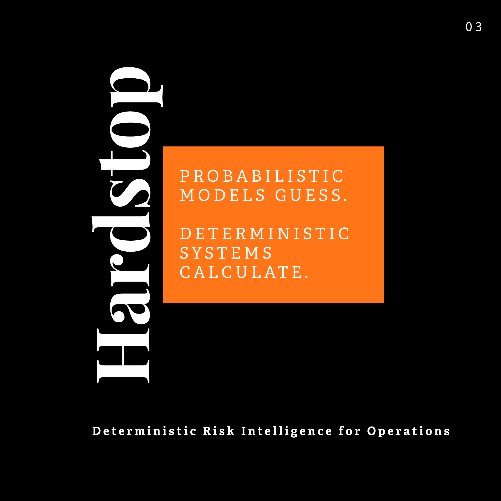

# Hardstop

Hardstop is a deterministic supply-chain risk engine. It monitors public alert sources (NWS, FDA, USCG, RSS feeds), links events to your operational network, and generates actionable risk briefs — all local, all auditable.

<p align="center">
  
</p>

## Why

Supply chain teams drown in alerts from dozens of sources. Hardstop filters the noise, scores impact against your actual facilities, lanes, and shipments, and produces daily briefs with clear classification: Interesting, Relevant, or Impactful. Same input always produces the same output.

## Quick Start

```bash
python -m venv .venv && source .venv/bin/activate   # Windows: .\.venv\Scripts\Activate.ps1
pip install --require-hashes -r requirements.lock.txt
pip install --no-deps -e .

hardstop init              # copy example configs
hardstop doctor            # verify environment
hardstop ingest            # load network data (facilities, lanes, shipments)
hardstop run --since 24h   # fetch + process events
hardstop brief --today --since 24h
```

## How It Works

1. **Fetch** — adapters pull from RSS/Atom, NWS Alerts API, FDA, USCG
2. **Filter** — configurable suppression rules drop noise (keyword, regex, exact match)
3. **Link** — events matched to your facilities, lanes, and shipments
4. **Score** — deterministic impact scoring with trust-tier weighting and quality validation
5. **Brief** — tier-aware daily summaries in markdown or JSON

## Key Commands

| Command | What it does |
|---------|-------------|
| `hardstop run --since 24h` | Fetch + ingest pipeline |
| `hardstop brief --today` | Generate daily brief |
| `hardstop doctor` | Health check (PATH, DB, configs, sources) |
| `hardstop sources health` | Source status table with failure budgets |
| `hardstop sources test <id>` | Test a single source |
| `hardstop export alerts --format csv` | Export alert data |
| `hardstop demo --mode pinned` | Deterministic demo run for verification |

Exit codes: **0** = healthy, **1** = warning, **2** = broken. Use `--strict` to fail on warnings.

## Configuration

- `config/sources.yaml` — external alert sources and tier settings
- `config/suppression.yaml` — noise filtering rules
- `hardstop.config.yaml` — quality thresholds and runtime settings

See [docs/CONFIGURATION.md](docs/CONFIGURATION.md) for the full reference.

## Design Principles

- **Local-first**: SQLite storage, no cloud dependencies
- **Deterministic**: strict mode guarantees identical inputs produce identical outputs
- **Self-evaluating**: exit codes and health checks surface problems, no silent failures
- **Auditable**: run records, config fingerprints, and artifact hashes for every execution

See [docs/ARCHITECTURE.md](docs/ARCHITECTURE.md) for the runtime specification.

## Project Structure

```
src/hardstop/
├── retrieval/       # Source adapters and fetching
├── suppression/     # Noise filtering engine
├── parsing/         # Event normalization and entity extraction
├── alerts/          # Alert generation, correlation, and impact scoring
├── database/        # SQLite storage, schema, and migrations
├── output/          # Brief generation and incident evidence
├── api/             # Query surface for alerts, briefs, and sources
├── ops/             # Run records, status evaluation, artifacts
├── runners/         # Executable workflows (demo, ingest, network load)
├── config/          # Configuration loading and defaults
└── cli.py           # CLI entrypoint
```

## Requirements

- Python 3.10+
- SQLite (bundled with Python)

## Tests

```bash
pytest
```

30 test files covering determinism regression, adapter parsing, alert quality validation, source health, suppression, and end-to-end pipeline verification.

## Documentation

- [Architecture](docs/ARCHITECTURE.md) — runtime spec, operator taxonomy, determinism contract
- [Configuration](docs/CONFIGURATION.md) — sources, suppression, quality thresholds
- [CSV Contract](docs/CSV_CONTRACT.md) — network data format for facilities, lanes, shipments
- [Integrations](docs/INTEGRATIONS.md) — Slack, CI/CD, and agent integration patterns
- [Specs](docs/specs/) — run-record schema, canonicalization, export format

## License

[Hardstop Business License (SBL-1.0)](LICENSE) — free for evaluation and personal use. Production use requires a commercial agreement with WhatsYourWhy, Inc. Dual-licenses to Apache 2.0 on January 1, 2029. See [docs/LICENSING.md](docs/LICENSING.md) for details.

## Changelog

See [CHANGELOG.md](CHANGELOG.md) for version history.
